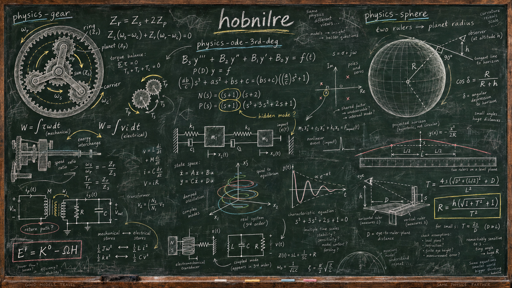

<!-- article-tools:articles:start -->
## Articles

Newest first, including updates. The order follows the creation time of each article's
latest published PDF (UTC), so a revised edition can move an older article up the list.

| Article | In brief | PDF created (UTC) |
| --- | --- | --- |
| [code-rank](https://github.com/hobnilre/code-rank) · [PDF](https://github.com/hobnilre/code-rank/blob/main/ranking-structured-objects.pdf) | Reversible coordinates for structures, constrained rhythms and melodies. | 2026-09-30 18:55:01 |
| [physics-ode-3rd-deg-op](https://github.com/hobnilre/physics-ode-3rd-deg-op) · [PDF](https://github.com/hobnilre/physics-ode-3rd-deg-op/blob/main/hidden-states-and-unassigned-work.pdf) | Hidden states, impact release and measurable energy transfers. | 2026-09-30 18:03:01 |
| [physics-ode-3rd-deg](https://github.com/hobnilre/physics-ode-3rd-deg) · [PDF](https://github.com/hobnilre/physics-ode-3rd-deg/blob/main/third-and-higher-order-odes.pdf) | Higher-order ODE coefficient synthesis, illustrated by an impact driver. | 2026-09-30 18:00:18 |
| [physics-gear-op](https://github.com/hobnilre/physics-gear-op) · [PDF](https://github.com/hobnilre/physics-gear-op/blob/main/finite-transfers-and-open-energy-balances.pdf) | Physical tests of loaded gears, switched returns and prepared states. | 2026-09-30 17:34:26 |
| [physics-gear](https://github.com/hobnilre/physics-gear) · [PDF](https://github.com/hobnilre/physics-gear/blob/main/frames-returns-and-port-power.pdf) | Four gear shafts, their loaded reactions and electrical counterparts. | 2026-09-30 17:25:17 |
| [rust-sim-the-book](https://github.com/hobnilre/rust-sim-the-book) · [PDF](https://github.com/hobnilre/rust-sim-the-book/blob/main/rust-sim-the-book.pdf) | A book on SIM architecture, kernel contracts, and reusable domain modules. | 2026-09-30 08:32:41 |
| [cpp-promote](https://github.com/hobnilre/cpp-promote) · [PDF](https://github.com/hobnilre/cpp-promote/blob/main/numeric-promotion-by-chained-visitors.pdf) | Numeric promotion in C++ interpreters using chained visitors. | 2026-09-28 14:58:14 |
| [music-motion](https://github.com/hobnilre/music-motion) · [PDF](https://github.com/hobnilre/music-motion/blob/main/musical-motion.pdf) | Directed musical motion from shared partials. | 2026-09-28 14:13:01 |
| [physics-sphere](https://github.com/hobnilre/physics-sphere) · [PDF](https://github.com/hobnilre/physics-sphere/blob/main/planet-radius-with-two-rulers.pdf) | Measure a planet’s radius from horizon curvature using two rulers. | 2026-09-28 10:34:09 |

<!-- article-tools:articles:end -->
